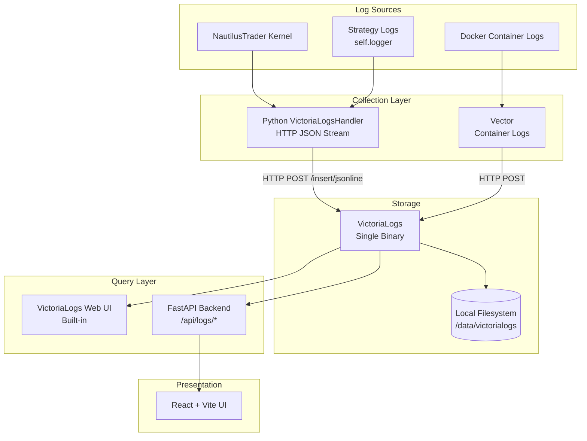

# Logging Architecture for NautilusTrader Platform

A pragmatic, low-maintenance logging design using **VictoriaLogs** and **Vector** for a personal trading platform.

> [!IMPORTANT]
> **Core Principle**: Trading must never depend on logging. If VictoriaLogs dies, trading continues without interruption.

---

## Why VictoriaLogs Instead of Loki

After evaluating both options, **VictoriaLogs is the clear winner** for your use case:

| Aspect | VictoriaLogs | Loki |
|--------|-------------|------|
| **RAM Usage** | ~30x less than Loki | Higher memory footprint |
| **High-Cardinality Fields** | Native support (trace_id, user_id, etc.) | Creates stream explosion, crashes |
| **Configuration** | Zero-config, sensible defaults | Complex YAML, many knobs |
| **Query Language** | LogsQL (simpler, faster) | LogQL (more complex) |
| **Built-in UI** | Yes, at `/select/vmui/` | No (requires Grafana) |
| **Grafana Plugin** | Yes (victoriametrics-logs-datasource) | Native |
| **Storage Efficiency** | 15x less disk than Elasticsearch | Good compression |
| **Setup Complexity** | Single binary, 1 flag for retention | Multiple configs, schema versions |

**For your constraints (single VM, 5 MB/day, solo operator), VictoriaLogs is ideal.**

---

## 1️⃣ Architecture Overview

### Full Log Flow



### Component Justification

| Component | Purpose | Can Be Removed? |
|-----------|---------|-----------------|
| **VictoriaLogsHandler** | Push Python logs directly to VictoriaLogs with `strategy_id` as stream field | No - core enrichment point |
| **Vector** | Collect Docker container logs (nginx, redis, ib-gateway). Modern, Rust-based, lighter/faster than Filebeat. | Yes - if container logs not needed |
| **VictoriaLogs** | Log storage with 14-day retention, LogsQL queries, built-in UI | No - central requirement |
| **VictoriaLogs Web UI** | Quick ad-hoc debugging at `http://localhost:9428/select/vmui/` | Optional but free |
| **Backend API** | Guardrailed queries for React UI, strategy-specific filtering | No - required for UI |
| **React UI** | User-facing log views on strategy cards | No - per requirements |

### Why This Design?

1. **No log files on disk** (except VictoriaLogs internal storage) - logs go directly via HTTP
2. **Fire-and-forget async pushing** - strategies don't block on logging
3. **Single binary VictoriaLogs** - one flag for retention, zero config
4. **Vector for container logs** - Ultra-efficient Rust agent, replaced heavier Filebeat

---

## 2️⃣ VictoriaLogs Data Model (Best Practices)

### Key Concepts

VictoriaLogs has three special field types:

| Field Type | Purpose | Example |
|------------|---------|---------|
| [_time](file:///root/ntp-remote/backend/app/strategies/implementations/SPX_15Min_Range.py#801-828) | Timestamp (auto-extracted) | `2026-01-21T22:16:38.123Z` |
| `_msg` | Log message body | `"Breakout detected at 5890.50"` |
| [_stream](file:///root/ntp-remote/backend/app/main.py#327-335) | Stream identifier (labels) | `{strategy_id="orb_15min_call_1", source="strategy"}` |

**All other fields are regular indexed fields** - no cardinality limits!

### Stream Fields Selection (Critical)

> [!WARNING]
> **Do NOT use high-cardinality fields as stream fields.** Stream fields define log partitioning. Use them for **grouping**, not for unique identifiers.

**Good stream fields** (low cardinality, define log sources):
- `strategy_id` (max 10)
- `source` (strategy, system, container)
- `level` (DEBUG, INFO, WARNING, ERROR, CRITICAL)

**Bad stream fields** (high cardinality, put in regular fields):
- `order_id` (unique per order)
- `instrument_id` (many options)
- `trace_id` (unique per request)

### Log Schema

```json
{
  "_time": "2026-01-21T22:16:38.123Z",
  "_msg": "Breakout detected, entering CALL position",
  
  "strategy_id": "orb_15min_call_1",
  "source": "strategy",
  "level": "INFO",
  "component": "ORB_15_Long_Call",
  
  "instrument": "SPXW241025C05850000",
  "action": "entry_trigger",
  "spx_price": 5890.50
}
```

- `strategy_id`, `source`, `level` → **stream fields** (via `_stream_fields` param)
- All other fields → **regular indexed fields** (queryable, no cardinality concern)

---

## 3️⃣ Python Log Handler for VictoriaLogs

### Implementation: `VictoriaLogsHandler`

- [backend/app/logging/victorialogs_handler.py](file:///root/ntp-remote/backend/app/logging/victorialogs_handler.py)

### Integration with Existing Codebase

Modify [backend/app/main.py](file:///root/ntp-remote/backend/app/main.py):

```python
# Add near top of file, after existing logging setup
import os
from app.logging.victorialogs_handler import VictoriaLogsHandler

# Configure VictoriaLogs handler
VICTORIALOGS_URL = os.getenv("VICTORIALOGS_URL", "http://victorialogs:9428")

victorialogs_handler = VictoriaLogsHandler(
    victorialogs_url=VICTORIALOGS_URL,
    stream_fields=("strategy_id", "source", "level"),
    extra_fields={"app": "nautilus-trader"},
)
victorialogs_handler.setLevel(logging.DEBUG)

# Add to root logger to capture all logs
logging.getLogger().addHandler(victorialogs_handler)

# Specifically ensure strategy loggers use it
logging.getLogger("strategy").addHandler(victorialogs_handler)
logging.getLogger("strategy").setLevel(logging.DEBUG)
```

### How This Fails Safely

| Failure Mode | Behavior | Impact on Trading |
|--------------|----------|-------------------|
| Queue overflow | Old logs dropped, new logs accepted | None |
| VictoriaLogs down | `requests.post` fails silently | None |
| Malformed log | Exception caught, log skipped | None |
| Thread crash | Daemon thread - exits with process | None |

---

## 4️⃣ VictoriaLogs Configuration (Single VM)

### Docker Compose Addition

```yaml
# Add to docker-compose.yml

  victorialogs:
    image: victoriametrics/victoria-logs:v1.43.0-victorialogs
    container_name: ntd-victorialogs
    command:
      - -storageDataPath=/data
      - -retentionPeriod=14d
      - -httpListenAddr=:9428
    volumes:
      - victorialogs-data:/data
    ports:
      - "9428:9428"
    networks:
      - ntd-network
    restart: unless-stopped

  # Vector for container logs
  vector:
    image: timberio/vector:0.52.0-alpine
    container_name: ntd-vector
    volumes:
      - ./vector/vector.toml:/etc/vector/vector.toml:ro
      - /var/lib/docker/containers:/var/lib/docker/containers:ro
      - /var/run/docker.sock:/var/run/docker.sock:ro
    networks:
      - ntd-network
    depends_on:
      - victorialogs

volumes:
  victorialogs-data:
```

### That's It!

No additional configuration files needed. VictoriaLogs uses sensible defaults:

| Setting | Default | Your Value |
|---------|---------|------------|
| Retention | 7 days | 14 days (`-retentionPeriod=14d`) |
| Storage | `/data` | Docker volume |
| HTTP Port | 9428 | 9428 |
| RAM limit | auto | auto (uses available) |

### Vector Configuration (`vector/vector.toml`)

```toml
[sources.docker_logs]
type = "docker_logs"
include_containers = ["ntd-nginx", "ntd-redis", "ntd-ib-gateway"]

[transforms.parse_logs]
type = "remap"
inputs = ["docker_logs"]
source = '''
# Parse additional metadata or JSON if needed
.source = "container"
.container_name = .container_name
'''

[sinks.victorialogs]
type = "elasticsearch"
inputs = ["parse_logs"]
endpoints = ["http://victorialogs:9428/insert/elasticsearch/"]
mode = "bulk"
bulk.action = "index"

# High-performance batching
batch.max_bytes = 1048576 # 1MB
batch.timeout_secs = 1
```

> [!NOTE]
> Vector is used here because it is Rust-based, highly efficient (low RAM/CPU), and integrates seamlessly with VictoriaLogs via the Elasticsearch bulk API.

### Failure Scenarios

| Scenario | Behavior | Recovery |
|----------|----------|----------|
| **VictoriaLogs restarts** | Logs during downtime are lost (fire-and-forget). Data persists in volume. | Automatic |
| **Disk fills** | VictoriaLogs rejects new logs. Trading unaffected. | Expand disk or reduce retention |
| **VictoriaLogs unavailable** | Handler silently drops logs. UI shows "no data". | Fix VictoriaLogs, logs resume |
| **Query timeout** | API returns error. UI shows "query failed" message. | Retry or narrow time range |

### Estimated Resource Usage

At your scale (5 MB/day, 10 logs/sec):

| Resource | Usage |
|----------|-------|
| RAM | ~20-50 MB |
| CPU | < 1% |
| Disk (14 days) | ~100-200 MB compressed |

---

## 5️⃣ LogsQL Query Examples

### Built-in Web UI

Access at `http://localhost:9428/select/vmui/` - no Grafana needed for quick debugging!

### Basic Queries

| Query Goal | LogsQL |
|------------|--------|
| All logs (last 5 min) | `_time:5m` |
| All strategy logs | `source:strategy` |
| Single strategy | `strategy_id:orb_15min_call_1` |
| All errors | `level:ERROR` |
| Strategy errors | `strategy_id:* level:ERROR` |
| Word search in message | `breakout` |
| Exact phrase | `"position opened"` |

### Pattern Matching

```logsql
# Regex match on message
_msg:~"order.*filled"

# Exclude word
error -kubernetes

# Numeric comparison (if field exists)
spx_price:>5900

# Time range
_time:[2026-01-21T22:00:00Z, 2026-01-21T23:00:00Z]
```

### Advanced Queries

```logsql
# All logs for a strategy in the last hour
strategy_id:orb_15min_call_1 _time:1h

# Errors with stack traces
level:ERROR error_traceback:*

# Order-related logs
_msg:~"(order|fill|position)" source:strategy

# Count logs by level (for debugging)
_time:1h | stats count() by (level)

# Show recent logs with specific fields
_time:5m strategy_id:* | fields _time, strategy_id, _msg
```

### What NOT to Query

| Bad Query | Why | Alternative |
|-----------|-----|-------------|
| `_time:30d` | Too slow, scans too much | Use `_time:24h` max |
| `*` with no time filter | Full table scan | Always add `_time:Xh` |
| PnL analytics | Not what logs are for | Use trades.db |

---

## 6️⃣ Backend API Design

### Endpoints

- [backend/app/routers/logs.py](file:///root/ntp-remote/backend/app/routers/logs.py)


### API Guardrails Summary

| Guardrail | Value | Purpose |
|-----------|-------|---------|
| `MAX_ENTRIES` | 500 | Prevent memory explosion |
| `MAX_RANGE_HOURS` | 24 | Prevent expensive full scans |
| `timeout` | 10s | Don't hang on slow queries |
| Default `_time` | 1 hour | Always scope by time |

---

## 7️⃣ React UI Integration

### Global Logs Page

Updated `LogViewer.tsx` to use the new API:

- [frontend/src/components/LogViewer.tsx](file:///root/ntp-remote/frontend/src/components/LogViewer.tsx)

### Strategy Details Integration

Added the `StrategyLogPanel` to the `Strategies.tsx` (or `StrategyDetails.tsx` if separate).

---

## 8️⃣ Explicit Non-Goals & Anti-Patterns

### ❌ What This System Does NOT Do

| Non-Goal | Reason |
|----------|--------|
| Analytics on logs | Use trades.db for PnL, win rate, etc. |
| Alerting on trade events | Too slow. Use webhooks or strategy signals. |
| Long-term storage | 14 days is enough. Historical analysis uses trades.db. |
| Log-based metrics | Use Prometheus for metrics. VictoriaLogs is for debugging. |
| Real-time streaming | Polling at 5s is sufficient for debugging. |

### ❌ What Should NOT Be Logged

| Don't Log | Reason |
|-----------|--------|
| Every tick | Way too much volume. Log meaningful events. |
| Raw market data | Use data feeds. Logs are not data storage. |
| Passwords/secrets | Obviously. |
| PnL values | Store in trades.db, not logs. |
| Health check pings | Creates noise. |

### ❌ Stream Field Mistakes to Avoid

| Bad Stream Field | Why | Fix |
|------------------|-----|-----|
| `instrument_id` | High cardinality (many options) | Regular field |
| `order_id` | Unique per order | Regular field |
| `trace_id` | Unique per request | Regular field |
| `timestamp` | Already `_time` | Remove |

**VictoriaLogs handles high-cardinality regular fields just fine - just don't make them stream fields!**

### ❌ Why Strategy Execution Must Never Block on Logging

```python
# BAD - Synchronous logging can block trading
def on_fill(self, fill):
    response = requests.post(victorialogs_url, data=log)  # ← Blocks!
    self.update_position(fill)  # ← Delayed!

# GOOD - Handler queues async, trading proceeds immediately
def on_fill(self, fill):
    self.logger.info(f"Fill: {fill}")  # ← Returns immediately
    self.update_position(fill)  # ← No delay
```

---

## 9️⃣ Impact on Current Codebase

### Summary

This logging implementation is **additive** - it does not remove or break existing functionality. The current file-based logging and WebSocket streaming will continue to work until you're confident in the new system.

### Backend Changes

| File | Impact | Risk |
|------|--------|------|
| `backend/app/main.py` | **Add** VictoriaLogsHandler import, configure it, add logs router | Low - additive only |
| `backend/app/routers/` | **New file** `logs.py` with API endpoints | None - new code |
| `backend/app/logging/` | **New directory** with `victorialogs_handler.py` | None - new code |

**No changes to existing strategy files, NautilusManager, or trade recording logic.**

### Frontend Changes

| File | Impact | Risk |
|------|--------|------|
| `frontend/src/components/LogViewer.tsx` | **Rewrite** from WebSocket to API polling | Medium - existing component |
| `frontend/src/pages/StrategyDetails.tsx` | **Add** StrategyLogPanel import and integration | Low - additive |
| `frontend/src/components/StrategyLogPanel.tsx` | **New file** | None - new code |

### Docker/Infrastructure Changes

| File | Impact | Risk |
|------|--------|------|
| `docker-compose.yml` | **Add** victorialogs, vector services | Low - additive |
| `vector/vector.toml` | **New file** | None - new config |

### What Stays the Same

| Component | Status |
|-----------|--------|
| Strategy `self.logger` calls | ✅ Unchanged - VictoriaLogsHandler intercepts via root logger |
| NautilusTrader kernel logging | ✅ Unchanged - same logger hierarchy |
| Trade recording to `trades.db` | ✅ Unchanged - completely separate system |
| Position management | ✅ Unchanged - not touched |
| WebSocket log streaming (`/ws/logs`) | ⚠️ Can be removed after migration, but works during transition |

### Migration Path

1. **Phase 1**: Deploy VictoriaLogs + Vector, add handler to `main.py`. Both systems run in parallel.
2. **Phase 2**: Update frontend to use new API. WebSocket endpoint still available as fallback.
3. **Phase 3**: Remove old WebSocket code and file-based log reading once stable.

> [!TIP]
> The VictoriaLogsHandler is fire-and-forget. If VictoriaLogs isn't running, the handler silently drops logs. This means you can deploy the backend changes before VictoriaLogs is ready.


# VictoriaLogs Logging Architecture - Implementation Complete

## Summary

Implemented a fire-and-forget logging architecture using **VictoriaLogs** and **Vector** for centralized log collection.

## Files Created

| File | Purpose |
|------|---------|
| [victorialogs_handler.py](file:///root/ntp-remote/backend/app/logging/victorialogs_handler.py) | Async Python handler - queues logs, pushes in background |
| [logs.py](file:///root/ntp-remote/backend/app/routers/logs.py) | FastAPI endpoints with guardrails (max 500 entries, 24h range) |
| [vector.toml](file:///root/ntp-remote/vector/vector.toml) | Container log collection config (using `text` codec for NDJSON) |
| [StrategyLogPanel.tsx](file:///root/ntp-remote/frontend/src/components/StrategyLogPanel.tsx) | Reusable log panel for strategy pages |

## Files Modified

| File | Change |
|------|--------|
| [main.py](file:///root/ntp-remote/backend/app/main.py) | Added VictoriaLogsHandler + logs router |
| [docker-compose.yml](file:///root/ntp-remote/docker-compose.yml) | Added victorialogs + vector services |
| [LogViewer.tsx](file:///root/ntp-remote/frontend/src/components/LogViewer.tsx) | Switched from WebSocket to API polling |
| [Strategies.tsx](file:///root/ntp-remote/frontend/src/components/Strategies.tsx) | Integrated StrategyLogPanel |

## Verification Status

- ✅ Python syntax valid
- ✅ Docker Compose config valid
- ✅ Services running (backend, victorialogs, vector, redis, ib-gateway)
- ✅ API Health: `http://localhost/api/logs/health` returns `healthy`
- ✅ Log Ingestion: Verified container logs appearing in VictoriaLogs via Vector
- ✅ Vector Config: Fixed NDJSON encoding for VictoriaLogs compatibility


## Troubleshooting

   - If logs stop appearing, check Vector logs: `docker logs ntd-vector`
   - Check VictoriaLogs status: `curl http://localhost:9428/health`

**Access VictoriaLogs UI:**
   - http://localhost:9428/select/vmui/

**Logs storage**

VictoriaLogs data is stored in a Docker Named Volume.
   - Logical Location:
   - Volume Name: ntp-remote_victorialogs-data
   - Container Path: /data (Mapped in docker-compose.yml)
   - Path: /var/lib/docker/volumes/ntp-remote_victorialogs-data/_data
This volume persists your logs even when the container is recreated. You can back it up by copying the physical directory or using a volume backup tool.