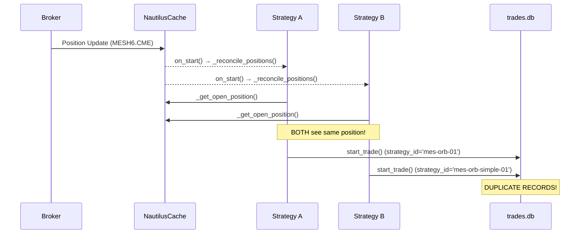
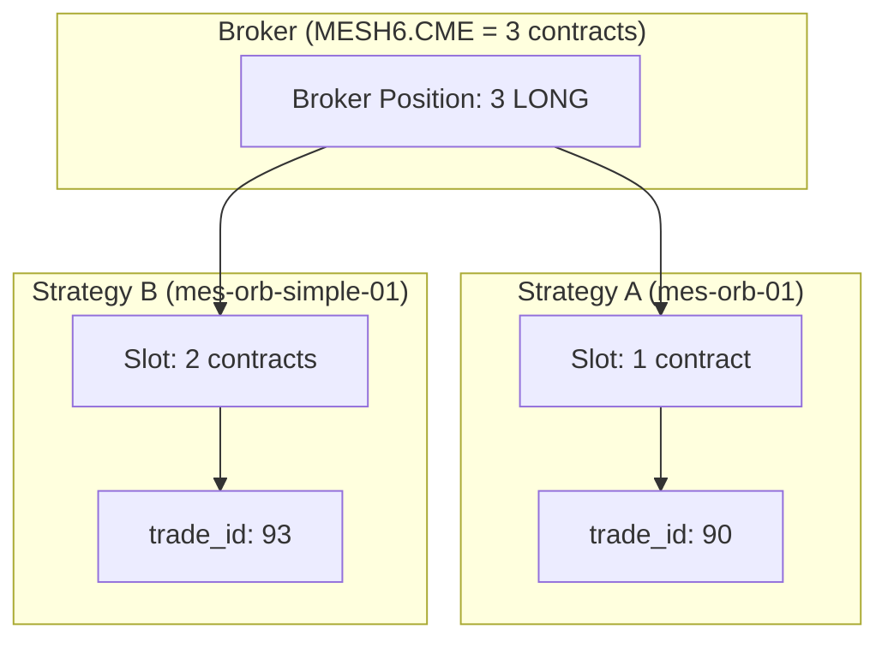

# Open Positions Handling Analysis

## Executive Summary

This report analyzes the open positions handling in the NTP trading platform, focusing on reliability, strategy logic impact, and correctness of trade record creation when multiple strategies share the same instrument.

> [!CAUTION]
> **Critical Issue Identified**: Two MES ORB strategies (`mes-orb-01` and `mes-orb-simple-01`) share the same instrument `MESH6.CME`. This causes **position stealing** and **duplicate trade records** because both strategies attempt to reconcile and adopt the same broker position.

---

## Current Architecture Overview

### Key Components

| Component | File | Responsibility |
|-----------|------|----------------|
| BaseStrategy | [base.py](file:///root/ntp-remote/backend/app/strategies/base.py) | Position reconciliation, order tracking, trade recording |
| TradeRecorder | [trade_recorder.py](file:///root/ntp-remote/backend/app/services/trade_recorder.py) | SQLite-based trade persistence |
| StrategyManager | [manager.py](file:///root/ntp-remote/backend/app/strategies/manager.py) | Lifecycle, status reporting, position filtering |
| NautilusManager | [nautilus_manager.py](file:///root/ntp-remote/backend/app/nautilus_manager.py) | Broker integration, global position tracking |

### Position Handling Flow



---

## Critical Findings

### 1. Position Stealing Between Strategies

**Location**: [base.py:234-266](file:///root/ntp-remote/backend/app/strategies/base.py#L234-L266)

**Issue**: The [_reconcile_positions()](file:///root/ntp-remote/backend/app/strategies/base.py#234-251) method in [BaseStrategy](file:///root/ntp-remote/backend/app/strategies/base.py#29-809) blindly adopts any open position that matches the strategy's instrument symbol. When multiple strategies share the same instrument, **all of them** adopt the same position.

```python
def _reconcile_positions(self):
    """Reconcile internal state with actual portfolio positions."""
    pos = self._get_open_position()
    
    if pos:
        self.logger.info(f"Reconciling: found open position ({pos.instrument_id})")
        self._on_position_reconciled(pos)  # ⚠️ No ownership check!
```

**Impact**:
- Strategy A opens a position → both A and B "own" it
- Strategy B may exit the position based on its own signals
- Strategy A's state becomes inconsistent

### 2. Duplicate Trade Records in Database

**Location**: [base.py:696-720](file:///root/ntp-remote/backend/app/strategies/base.py#L696-L720)

**Issue**: When reconciling, [_on_position_reconciled()](file:///root/ntp-remote/backend/app/strategies/base.py#252-266) creates a new trade record if `active_trade_id is None`, without checking if another strategy already recorded this position.

```python
def _on_position_reconciled(self, position: Position):
    # ...
    if self.active_trade_id is None:
        self.logger.info("Starting trade record for reconciled position")
        self._schedule_async_task(
            self._start_trade_record_from_position_async(position)
        )
```

**Evidence from State Files**:

| Strategy | instrument_id | active_trade_id |
|----------|---------------|-----------------|
| mes-orb-01 | MESH6.CME | `null` |
| mes-orb-simple-01 | MESH6.CME | `93` |

Both strategies target the same instrument. When `mes-orb-simple-01` opened a position, `mes-orb-01` may later "discover" and record it as well if restarted.

### 3. Weak Ownership Verification in Manager

**Location**: [manager.py:275-293](file:///root/ntp-remote/backend/app/strategies/manager.py#L275-L293)

**Current Logic** (defensive but incomplete):
```python
def _get_strategy_positions(self, strategy: BaseStrategy) -> list:
    pos = strategy._get_open_position()
    if not pos:
        return []
    
    # DEFENSIVE: Filter if strategy has no active trade
    if not strategy.active_trade_id and not strategy._pending_entry_orders and not strategy._pending_exit_orders:
        logger.debug(f"Strategy {strategy.strategy_id} 'sees' position but has no active trade record. Filtering out.")
        return []
```

**Problem**: This only filters for **display purposes**. The actual reconciliation and trade recording still occurs in [BaseStrategy](file:///root/ntp-remote/backend/app/strategies/base.py#29-809).

### 4. No Position Ownership Tracking

**Root Cause**: The database schema has no mechanism to track which strategy "owns" a position at the broker level:

```sql
CREATE TABLE trades (
    id INTEGER PRIMARY KEY AUTOINCREMENT,
    strategy_id TEXT NOT NULL,       -- ✓ Records who claimed it
    instrument_id TEXT NOT NULL,     -- ✓ The symbol
    -- BUT: No broker_position_id or unique constraint!
);
```

Multiple strategies can create trade records for the same position, and there's no way to prevent or detect this.

---

## Reliability Assessment

### Risk Matrix

| Risk | Severity | Likelihood | Impact |
|------|----------|------------|--------|
| Position stealing | 🔴 High | High (when both enabled) | Exit signals from wrong strategy |
| Duplicate trade records | 🔴 High | High | Incorrect P&L reporting |
| Orphaned trades | 🟡 Medium | Medium | Trades with no exit record |
| State desync on restart | 🟡 Medium | Medium | Stale state from persisted files |
| Race condition on fills | 🟢 Low | Low | Order tracking via sets |

### Affected Strategies

Currently, both MES strategies are configured to use the same instrument:

| Strategy ID | Type | Instrument | Enabled |
|-------------|------|------------|---------|
| `mes-orb-01` | MesOrbStrategy | `MESH6.CME` | ✓ |
| `mes-orb-simple-01` | MesOrbSimpleStrategy | `MESH6.CME` | ✓ |

---

## Impact on Strategy Logic

### Scenario Analysis

#### Scenario 1: Both Strategies Enabled (Current State)

1. `mes-orb-simple-01` enters LONG at 9:50 AM
2. Both strategies set `active_trade_id`, `entry_price`, `position_side`
3. `mes-orb-01` (no retest logic) may exit at 15:55 based on its own rules
4. `mes-orb-simple-01` loses its position unexpectedly

#### Scenario 2: Strategy Restart During Position

1. `mes-orb-simple-01` has open position with `active_trade_id=93`
2. Service restarts → both strategies call [_reconcile_positions()](file:///root/ntp-remote/backend/app/strategies/base.py#234-251)
3. `mes-orb-01` sees no `active_trade_id` in its state → creates new trade record
4. Database now has duplicate entry for same position

#### Scenario 3: Conflicting Exit Signals

1. Both strategies track the same position
2. `mes-orb-01` trailing stop at 6870, `mes-orb-simple-01` trailing stop at 6882.5
3. Price drops to 6875 → `mes-orb-simple-01` exits
4. `mes-orb-01` still thinks it has a position → state corruption

---

## Proposed Improvements (Multi-Strategy Compatible)

> [!NOTE]
> These improvements are designed to support **multiple strategies trading the same instrument** for A/B testing while preventing duplicate records and position stealing.

### Priority 1: Order-ID-Based Position Ownership (Critical)

**Principle**: A strategy only "owns" a position if **it submitted the entry order**.

```python
def _reconcile_positions(self):
    """Reconcile only if we have evidence of our own trade."""
    pos = self._get_open_position()
    
    if not pos:
        # Clear stale state
        if self.active_trade_id:
            self.active_trade_id = None
            self.save_state()
        return
    
    # CRITICAL: Only reconcile if we have an active_trade_id from a previous session
    # This means WE opened this position before a restart
    if self.active_trade_id is not None:
        self.logger.info(f"Resuming ownership of position (trade_id={self.active_trade_id})")
        self._on_position_reconciled(pos)
    else:
        # Position exists but we don't own it - another strategy does
        self.logger.info(f"Position exists for {pos.instrument_id} but no active_trade_id - not our trade")
```

**Implementation**: Modify [base.py:234-266](file:///root/ntp-remote/backend/app/strategies/base.py#L234-L266)

---

### Priority 2: Database Unique Index for Open Trades Per Strategy

Allow multiple open trades for the same instrument **from different strategies**:

```sql
-- Each strategy can have at most ONE open trade per instrument
CREATE UNIQUE INDEX idx_one_open_trade_per_strategy_instrument 
ON trades (strategy_id, instrument_id) 
WHERE exit_time IS NULL;
```

This prevents duplicate records from the **same** strategy while allowing multiple strategies to trade independently.

---

### Priority 3: Position Slot Tracking Table

Track which strategy owns which portion of brokerposition:

```sql
CREATE TABLE position_slots (
    id INTEGER PRIMARY KEY AUTOINCREMENT,
    instrument_id TEXT NOT NULL,
    strategy_id TEXT NOT NULL,
    quantity REAL NOT NULL,          -- This strategy's claimed quantity
    trade_id INTEGER REFERENCES trades(id),
    created_at TEXT NOT NULL,
    UNIQUE(strategy_id, instrument_id)  -- One slot per strategy per instrument
);
```

**Usage**:
- When strategy A opens 1 contract → insert slot (strategy_id=A, qty=1)
- When strategy B opens 2 contracts → insert slot (strategy_id=B, qty=2)
- Total broker position = 3 contracts
- Each strategy only manages its own slot

---

### Priority 4: Entry Fill Attribution

Attribute positions based on **who submitted the order**:

```python
def _on_entry_filled(self, event):
    """Handle entry fill - claim ownership."""
    # Only record trade if THIS strategy submitted the order
    if event.client_order_id not in self._pending_entry_orders:
        self.logger.warning(f"Received fill for order {event.client_order_id} we didn't submit")
        return
    
    self._last_entry_price = float(event.last_px)
    self._last_entry_qty = float(event.last_qty)
    
    # Start trade record (establishes ownership)
    self._schedule_async_task(self._start_trade_record_async(event))
```

---

### Priority 5: Configurable Strategy Behavior

Add config parameter to control reconciliation behavior:

```json
{
    "id": "mes-orb-simple-01",
    "reconcile_orphan_positions": false,  // Don't adopt positions we didn't open
    "max_positions": 1                     // Limit number of concurrent positions
}
```

```python
def _reconcile_positions(self):
    if not self.strategy_config.parameters.get("reconcile_orphan_positions", True):
        # Only reconcile if we have proof of ownership
        if self.active_trade_id is None:
            return
    # ... existing logic
```

---

### Architecture Diagram: Multi-Strategy Position Isolation



---

### Implementation Order

| Step | Change | Files | Complexity |
|------|--------|-------|------------|
| 1 | Add `reconcile_orphan_positions` config check | base.py | Low |
| 2 | Only reconcile if `active_trade_id` exists | base.py | Low |
| 3 | Add unique index (strategy_id, instrument_id) | trade_recorder.py | Low |
| 4 | Create `position_slots` table | trade_recorder.py | Medium |
| 5 | Track slots on entry/exit | base.py | Medium |

---

## Immediate Actions

1. **Disable one strategy**: Until fixes are implemented, disable either `mes-orb-01` or `mes-orb-simple-01` to prevent conflicts.

2. **Clean up database**: Review and remove duplicate trade records:
   ```sql
   -- Find duplicate open trades
   SELECT instrument_id, COUNT(*) as cnt
   FROM trades
   WHERE exit_time IS NULL
   GROUP BY instrument_id
   HAVING cnt > 1;
   ```

3. **Reset strategy states**: Clear state files if inconsistent:
   ```bash
   rm data/strategies/state/mes-orb-01.json
   ```

---

## Summary Table

| Issue | Severity | Fix Complexity | Recommendation |
|-------|----------|----------------|----------------|
| Position stealing | 🔴 Critical | Medium | Implement ownership check |
| Duplicate trade records | 🔴 Critical | Low | Add database unique index |
| No instrument conflict check | 🟡 High | Low | Add validation in manager |
| State desync on restart | 🟡 Medium | Medium | Enhanced persistence |
| No broker position ID | 🟢 Low | High | Future enhancement |

---

## Files Referenced

- [base.py](file:///root/ntp-remote/backend/app/strategies/base.py) - Position reconciliation
- [manager.py](file:///root/ntp-remote/backend/app/strategies/manager.py) - Strategy lifecycle
- [trade_recorder.py](file:///root/ntp-remote/backend/app/services/trade_recorder.py) - Database operations
- [mes-orb-01.json](file:///root/ntp-remote/data/strategies/config/mes-orb-01.json) - Strategy config
- [mes-orb-simple-01.json](file:///root/ntp-remote/data/strategies/config/mes-orb-simple-01.json) - Strategy config
