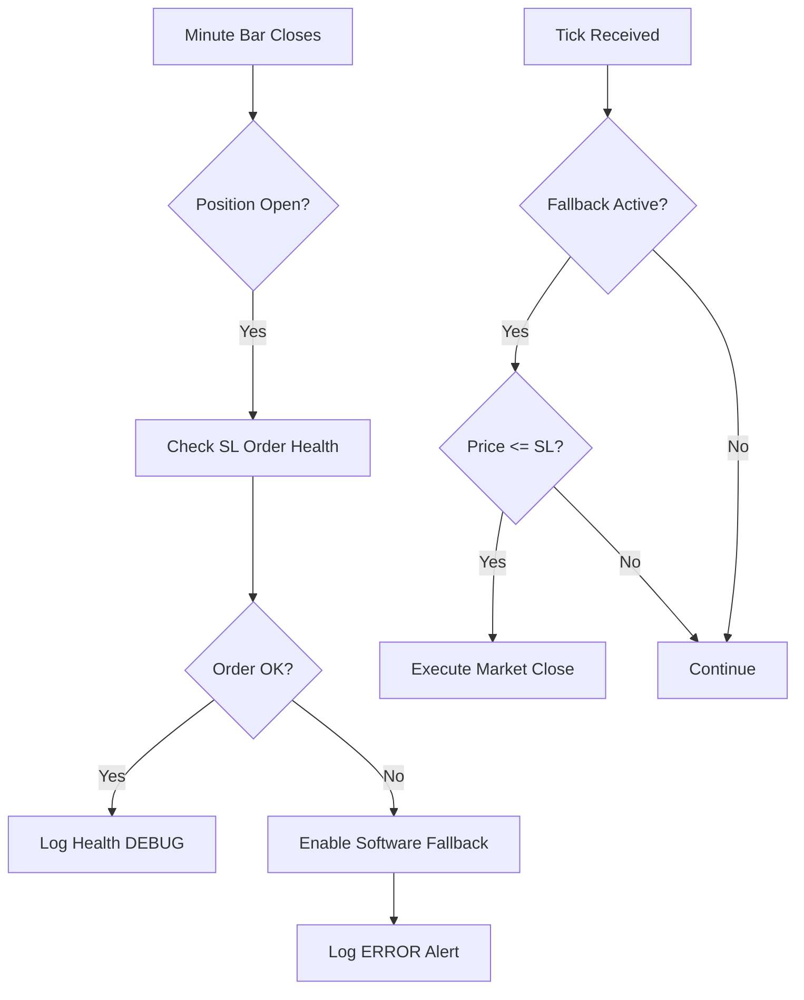

# ORB Strategy Reliability Improvements: Stop-Loss & Monitoring

This document details the architectural improvements made to the Opening Range Breakout (ORB) strategies to ensure reliable trade exits and clean operation in production.

## 1. Overview
The primary goal was to address scenarios where broker-side Stop Loss (SL) orders were cancelled or lost by the broker/adapter (observed with SPX options on IBKR), leaving positions unprotected. Additionally, the system was optimized to reduce log volume while maintaining high-speed reaction times for risk management.

## 2. Problem Statement
*   **Broker SL Cancellations:** Observed logs showed the IBKR adapter sometimes canceling SL orders (STOP_LIMIT) due to "not found" errors or lack of venue acknowledgment.
*   **Log Spam:** The `PASSIVE ALERT` log triggered on every tick once the price crossed the SL/TP threshold, generating thousands of redundant messages.
*   **Performance:** Constant tick-by-tick monitoring of all exit conditions increased CPU overhead unnecessarily.

## 3. Key Improvements

### 3.1. Throttled Alerting
Alerts for Stop Loss and Take Profit levels now use a "fire-once-per-event" logic.
*   **Mechanism:** Added `_sl_alert_fired` and `_tp_alert_fired` flags.
*   **Behavior:** The `PASSIVE ALERT` message is logged only the first time a price breach is detected during a trade. Flags are reset automatically when the position is cleared.

### 3.2. Sequential SL Heartbeat (Heartbeat Check)
A "Heartbeat" mechanism was added to the base strategy to verify the health of the broker-side SL order.
*   **Implementation:** `_check_sl_order_health()` runs inside the minute-bar closure (`on_minute_closed`).
*   **Logic:** 
    1. Verifies the order exists in the local cache.
    2. Checks if the order is in a terminal state (`CANCELED`, `REJECTED`, `EXPIRED`, `DENIED`).
    3. If the SL order is dead or missing, the strategy automatically enables **Software SL Fallback**.
*   **Logging:** Healthy heartbeats are logged at the `DEBUG` level for traceability without cluttering production logs.

### 3.3. Dual-Mode Software SL Fallback
To ensure maximum reliability without high CPU usage, the software fallback operates in two modes:

| Mode | Trigger | Frequency | Purpose |
| :--- | :--- | :--- | :--- |
| **Silent Monitoring** | Default | Once per Minute | Checks order health and alerts operator. |
| **Active Fallback** | SL Failure | Every Tick | High-speed monitoring of the option mid-price to execute an urgent `Market Close` if the SL level is hit. |

This ensures that under normal conditions (broker SL active), CPU usage is low. If the critical protection (broker SL) fails, the strategy initiates high-frequency monitoring for that specific instrument.

### 3.4. Minute-Bar Processing
Primary strategy logic (Exit alerts and health checks) moved to `on_minute_closed`.
*   **Benefit:** Reduces log noise of strategy status updates.
*   **Latency:** Standard exit monitoring has a 1-minute resolution, while the **Software Fallback** retains sub-second resolution once activated.

## 4. Architectural Summary

### Core Logic Flow (Heartbeat & Fallback)

## 5. Affected Components
*   `BaseStrategy` (`base.py`): Implements the monitoring state machine and heartbeat logic.
*   `Orb15MinLongCallStrategy`: Updated to support throttled alerts and minute-bar logic.
*   `Orb15MinLongPutStrategy`: Updated to support throttled alerts and minute-bar logic.

## 6. How to Verify
1.  Check logs for `✓ SL heartbeat OK` (requires DEBUG level).
2.  In a live/paper environment, manually cancel the SL order in TWS. 
3.  The strategy should log: `⚠️ SL ORDER CANCELLED BY BROKER - Enabling software fallback`.
4.  If the price hits the SL level after this, it will log: `🛑 SOFTWARE SL TRIGGERED` and close the position via a market order.
## 7. Logging Reference

The following table summarizes the logs generated by the reliability system.

| Event | Level | Log Message Pattern | Purpose |
| :--- | :--- | :--- | :--- |
| **SL order submitted** | `INFO` | `✅ Sequential bracket legs submitted \| ListID: ...` | Logged when SL/TP orders are sent to broker. |
| **Heartbeat OK** | `DEBUG` | `✓ SL heartbeat OK \| Order: ... \| Status: ... \| SL: $...` | Periodic confirmation that SL order is active in cache. |
| **SL missing from cache** | `ERROR` | `⚠️ SL ORDER NOT FOUND IN CACHE - Enabling software fallback \| Order ID: ... \| SL Price: $...` | Triggered if SL order vanishes from cache. |
| **SL in terminal state** | `ERROR` | `⚠️ SL ORDER IN TERMINAL STATE (...) - Enabling software fallback \| Order ID: ... \| SL Price: $...` | Triggered if order is CANCELED/REJECTED/EXPIRED. |
| **SL order cancelled** | `ERROR` | `⚠️ SL ORDER CANCELLED BY BROKER - Enabling software fallback \| ID: ...` | Immediate detection via order cancellation event. |
| **Software SL triggered** | `WARNING` | `🛑 SOFTWARE SL TRIGGERED @ $... <= $...` | Execution of the final safety market order. |
| **Passive Alert (SL)** | `WARNING` | `⚠️ PASSIVE ALERT: Price hit 🛑 Stop Loss level...` | Logged when price hits SL (Throttled to once/trade). |
| **Passive Alert (TP)** | `INFO` | `✨ PASSIVE ALERT: Price hit ✅ Take Profit level...` | Logged when price hits TP (Throttled to once/trade). |

### Structured Logging Data
All reliability logs include extra fields for filtering in VictoriaLogs/Grafana:
*   `event_type`: (e.g., `sl_heartbeat_ok`, `sl_fallback_enabled`, `software_sl_triggered`, `sl_order_missing`)
*   `sl_order_id`: The ID of the monitored order.
*   `sl_price`: The execution level and fallback price.

