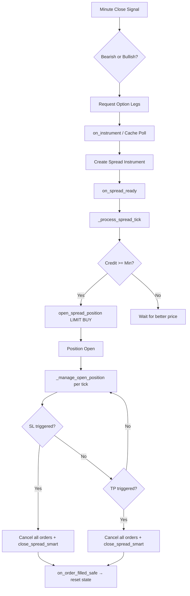

# Order Processing, Stop Loss & Take Profit — Logic Correctness Analysis

> **Scope**: [base.py](file:///root/ntp-remote/backend/app/strategies/base.py), [base_spx.py](file:///root/ntp-remote/backend/app/strategies/base_spx.py), [SPX_15Min_Range.py](file:///root/ntp-remote/backend/app/strategies/implementations/SPX_15Min_Range.py)

---

## 1. End-to-End Order Lifecycle Summary



---

## 2. Findings — Critical Issues

### 2.1 ⛔ Entry Marks `traded_today = True` BEFORE Fill Confirmation

**Location**: [SPX_15Min_Range.py L929-930](file:///root/ntp-remote/backend/app/strategies/implementations/SPX_15Min_Range.py#L929-L930)

```python
self.open_spread_position(...)
self.traded_today = True          # ← Set IMMEDIATELY
self.entry_in_progress = False    # ← Also cleared
self._spread_entry_price = abs(rounded_mid)
```

**Problem**: [open_spread_position()](file:///root/ntp-remote/backend/app/strategies/base.py#497-620) only **submits** the order — it doesn't wait for it to fill. If the LIMIT order is never filled (expires, rejected, cancelled), the strategy still believes it traded today and will **refuse all further entries**. The day is effectively dead.

**Impact**: A single unfilled entry order blocks an entire trading day.

> [!CAUTION]
> This is the **most impactful correctness bug** in the codebase. The entire daily P&L depends on actually entering a trade.

**Fix direction**: Move `traded_today = True` into [on_order_filled_safe](file:///root/ntp-remote/backend/app/strategies/base.py#2050-2051) when confirming the entry fill, not on order submission.

---

### 2.2 ⛔ Trade Record Created Before Fill

**Location**: [SPX_15Min_Range.py L1013-1054](file:///root/ntp-remote/backend/app/strategies/implementations/SPX_15Min_Range.py#L1013-L1054)

[start_trade()](file:///root/ntp-remote/backend/app/strategies/base.py#1742-1823) and `record_order(status="FILLED")` are called immediately after [open_spread_position()](file:///root/ntp-remote/backend/app/strategies/base.py#497-620), before the broker confirms the fill. This creates:

1. A trade record in the DB with `status=FILLED` even though the order may still be pending.
2. If the order is rejected/cancelled, the trade record remains with `FILLED` status — a data integrity violation.
3. On daily reset, [_reset_daily_state](file:///root/ntp-remote/backend/app/strategies/implementations/SPX_15Min_Range.py#1526-1567) calls `cancel_trade()` for orphaned `_current_trade_id`, which partially mitigates this, but only if the strategy survives until the next day.

---

### 2.3 ⛔ SL Close Uses Mid-Based Limit — May Not Fill

**Location**: [SPX_15Min_Range.py L1247-1248](file:///root/ntp-remote/backend/app/strategies/implementations/SPX_15Min_Range.py#L1247-L1248)

```python
sl_limit = mid - 0.05
self.close_spread_smart(limit_price=sl_limit)
```

When SL triggers, the code submits a LIMIT order at `mid - $0.05`. In a fast-moving market (where SL is being hit), the price can gap beyond this limit. The order may sit unfilled, and because `_sl_triggered = True`, the SL will **never re-trigger**. The position stays open with unlimited risk.

**Mitigation already present**: [_handle_close_order_failure](file:///root/ntp-remote/backend/app/strategies/implementations/SPX_15Min_Range.py#1846-1872) (L1846-1871) resets `_closing_in_progress` on cancel/reject/expire, allowing [_manage_open_position](file:///root/ntp-remote/backend/app/strategies/implementations/SPX_15Min_Range.py#1094-1283) to re-enter the SL/TP check. **However**, `_sl_triggered` is NOT reset there, so SL will not re-fire — only TP or manual close can happen.

> [!WARNING]
> If the SL close order is cancelled/expired and the market keeps moving against you, the `_sl_triggered = True` flag prevents any further SL attempts. Only TP (which would be wrong direction) or strategy stop will close the position.

**Fix direction**: Either use MARKET orders for SL, or reset `_sl_triggered = False` in [_handle_close_order_failure](file:///root/ntp-remote/backend/app/strategies/implementations/SPX_15Min_Range.py#1846-1872).

---

### 2.4 ⛔ TP Close Uses Calculated Limit — Not Current Market

**Location**: [SPX_15Min_Range.py L1281](file:///root/ntp-remote/backend/app/strategies/implementations/SPX_15Min_Range.py#L1281)

```python
self.close_spread_smart(limit_price=tp_price)
```

The TP price (`tp_price`) is a theoretical target, not the current market price. If the spread has moved in your favor significantly (mid is much higher than `tp_price`), the LIMIT order is placed at `tp_price`, which may be **well below current mid**. This should fill immediately in practice (it's below mid = you're giving money away), but:

- If the market reverses between trigger and execution, the order may not fill.
- The real issue is: you're leaving money on the table by not using the actual favorable price.

---

## 3. Findings — Moderate Issues

### 3.1 ⚠️ Partial Fill on Entry — Incorrect State

**Scenario**: Entry LIMIT order is partially filled (e.g., 1 of 2 spreads). Then:

1. [on_order_filled](file:///root/ntp-remote/backend/app/strategies/base.py#1541-1674) → [_on_entry_filled](file:///root/ntp-remote/backend/app/strategies/base.py#1675-1711) in base.py updates `signed_inventory` and creates a trade record via [_start_trade_record_async](file:///root/ntp-remote/backend/app/strategies/base.py#1742-1823).
2. But `SPX_15Min_Range` already set `traded_today = True`, `_spread_entry_price`, and created its own trade record **before** any fill.
3. Now we have **two competing trade record systems**: the base class async one (via `_integration_manager`) and the SPX strategy's direct `_trading_data.start_trade()`.
4. If the remaining quantity is never filled (cancelled), `_spread_entry_price` is based on the full intended credit, but the actual position is smaller.

**Impact**: P&L calculations in [_manage_open_position](file:///root/ntp-remote/backend/app/strategies/implementations/SPX_15Min_Range.py#1094-1283) use `current_qty = abs(self.get_effective_spread_quantity())` which correctly reflects the actual position size, so the total P&L is correct. But `entry_credit` remains based on the submitted limit price, not the actual fill price — which is acceptable for limit orders (fill price = limit or better).

**Remaining risk**: The exit order quantity in [on_order_filled_safe](file:///root/ntp-remote/backend/app/strategies/base.py#2050-2051) (L1796) uses `self.config_quantity` (the target), not the actual filled quantity:
```python
filled_quantity=self.config_quantity,  # Should be current_qty
```

---

### 3.2 ⚠️ Dual Trade Recording Systems

The codebase has **two parallel trade recording paths**:

| Path | Trigger | Used by |
|------|---------|---------|
| `BaseStrategy._start_trade_record_async()` | Entry fill via [on_order_filled](file:///root/ntp-remote/backend/app/strategies/base.py#1541-1674) → [_on_entry_filled](file:///root/ntp-remote/backend/app/strategies/base.py#1675-1711) | Base class, uses `_integration_manager.trading_data_service` |
| `SPX_15Min_Range._check_and_submit_entry()` | Order submission (before fill!) | SPX strategy, uses `self._trading_data` (direct) |

Both can fire for the same trade. The base class path is gated on `_integration_manager` existing, the SPX path always fires. If both run, you get duplicate trade records in the database under different IDs.

---

### 3.3 ⚠️ [close_spread_smart](file:///root/ntp-remote/backend/app/strategies/base.py#760-835) May Submit Wrong Quantity on Partial Close

**Location**: [base.py L760-834](file:///root/ntp-remote/backend/app/strategies/base.py#L760-L834)

[close_spread_smart()](file:///root/ntp-remote/backend/app/strategies/base.py#760-835) calls [get_effective_spread_quantity()](file:///root/ntp-remote/backend/app/strategies/base.py#683-759) to determine how much to close. If a previous close order partially filled (e.g., closed 1 of 2 lots), the next call to [close_spread_smart()](file:///root/ntp-remote/backend/app/strategies/base.py#760-835) would correctly read the remaining quantity. **This is fine.**

However, `_closing_in_progress` prevents re-entry into the SL/TP check while the first close order is pending. If the first close order partially fills and then expires, the failsafe handler resets `_closing_in_progress`, and the next tick re-evaluates. **This works correctly** for TP but not for SL (due to `_sl_triggered`, see issue 2.3).

---

### 3.4 ⚠️ `_closing_in_progress` Not Persisted Correctly After Restart

**Location**: [SPX_15Min_Range.py L1579](file:///root/ntp-remote/backend/app/strategies/implementations/SPX_15Min_Range.py#L1579)

`_closing_in_progress` is persisted and restored. If the strategy restarts mid-close:
- `_closing_in_progress = True` is restored.
- But there's no mechanism to re-submit the close order after restart.
- The position stays open, and [_manage_open_position](file:///root/ntp-remote/backend/app/strategies/implementations/SPX_15Min_Range.py#1094-1283) won't act because `_closing_in_progress = True`.

**Mitigation**: The only escape is if the original close order expires/cancels (triggering the failsafe), which may happen if TIF is DAY and the next day starts. But for an intraday strategy, this could leave a position unmanaged for the rest of the day.

---

### 3.5 ⚠️ Entry Timeout Doesn't Cancel Active Spread Orders

**Location**: [SPX_15Min_Range.py L1481-1520](file:///root/ntp-remote/backend/app/strategies/implementations/SPX_15Min_Range.py#L1481-L1520)

When spread instrument IS ready but no acceptable quote came, the timeout handler says "Continuing to wait for acceptable quote..." and does nothing. If the signal expires (5 seconds), the [_check_and_submit_entry](file:///root/ntp-remote/backend/app/strategies/implementations/SPX_15Min_Range.py#826-1075) method calls [_cancel_entry()](file:///root/ntp-remote/backend/app/strategies/implementations/SPX_15Min_Range.py#1076-1093) which resets state but **does not cancel any open orders on the spread instrument**.

If the entry was already submitted (spread was found and order placed), neither the timeout nor [_cancel_entry](file:///root/ntp-remote/backend/app/strategies/implementations/SPX_15Min_Range.py#1076-1093) attempts to cancel the pending LIMIT entry order.

---

## 4. Findings — Minor Issues / Design Notes

### 4.1 Signal Direction Not Cleared on Restart

`_signal_direction` is persisted and restored. If the strategy restarts after a trade was entered but before exit, `_signal_direction` is used in [on_order_filled_safe](file:///root/ntp-remote/backend/app/strategies/base.py#2050-2051) to determine exit reason (L1788). This is correct — it needs to survive restarts.

However, `_signal_time` is NOT persisted. After restart, the signal freshness check in [_check_and_submit_entry](file:///root/ntp-remote/backend/app/strategies/implementations/SPX_15Min_Range.py#826-1075) (L854-870) will use `None`, bypassing the staleness check. Since `entry_in_progress` is not persisted either (it's not in [get_state](file:///root/ntp-remote/backend/app/strategies/base_spx.py#391-409)), this is mostly safe — the entry won't resume after restart.

### 4.2 `entry_in_progress` Not Persisted

`entry_in_progress` is reset to `False` in [_reset_daily_state](file:///root/ntp-remote/backend/app/strategies/implementations/SPX_15Min_Range.py#1526-1567) and in [_cancel_entry](file:///root/ntp-remote/backend/app/strategies/implementations/SPX_15Min_Range.py#1076-1093), but if the strategy restarts mid-entry-sequence (instruments requested, polling in progress), the state is lost. After restart, `entry_in_progress = False` (default), so the strategy won't continue the entry sequence — which is safe behavior (better to miss a trade than enter incorrectly).

### 4.3 Commission Tracking — Spread vs Leg Deduplication

The commission tracking in [on_order_filled_safe](file:///root/ntp-remote/backend/app/strategies/base.py#2050-2051) (L1654-1701) has solid deduplication logic using `trade_id` (execution ID). It correctly ignores leg-level commissions when spread-level commissions are reported. This is well-designed for IB's behavior.

### 4.4 [on_minute_closed](file:///root/ntp-remote/backend/app/strategies/implementations/SPX_15Min_Range.py#226-465) Can Trigger Both Breach AND Entry in Same Minute

**Location**: [SPX_15Min_Range.py L257-464](file:///root/ntp-remote/backend/app/strategies/implementations/SPX_15Min_Range.py#L257-L464)

The breach detection (L257-291) and entry check (L334-464) both run in the same method call. If price closes below `or_low`:
1. `low_breached = True` is set (L290)
2. Then the BEARISH entry check fires (L334) and passes (because `high_breached` is checked, not `low_breached`)

This is **intentionally correct** — bearish entry requires close below Low, which naturally means Low is breached. The cross-invalidation only blocks when the **opposite** side was breached first.

### 4.5 `spread_id` Not Reset Between Days

`spread_id` and [spread_instrument](file:///root/ntp-remote/backend/app/strategies/implementations/SPX_15Min_Range.py#782-805) are set during entry and never explicitly cleared in [_reset_daily_state](file:///root/ntp-remote/backend/app/strategies/implementations/SPX_15Min_Range.py#1526-1567). Since 0DTE options expire daily, the stale spread instrument from yesterday would be invalid. However, [_create_spread_instrument](file:///root/ntp-remote/backend/app/strategies/implementations/SPX_15Min_Range.py#782-805) creates a new spread each time, and the `_waiting_for_spread` + `spread_id is None` guard (L737) prevents creation only if `spread_id` is already set.

> [!IMPORTANT]
> If `spread_id` from yesterday is still set, the guard on L737 blocks today's spread creation via [on_instrument](file:///root/ntp-remote/backend/app/strategies/base_spx.py#803-830). The fallback poll has the same guard (L1441). **This can prevent entry on the next trading day.** `spread_id` should be reset in [_reset_daily_state](file:///root/ntp-remote/backend/app/strategies/implementations/SPX_15Min_Range.py#1526-1567).

---

## 5. Scenario Matrix

| Scenario | Handled? | Notes |
|----------|----------|-------|
| **Happy path**: Signal → Entry fills → SL/TP fills | ✅ | Works correctly |
| **Entry rejected** by broker | ❌ | `traded_today = True` already set → day is dead |
| **Entry cancelled** (unfilled LIMIT) | ❌ | Same as above |
| **Entry partially filled** → rest cancelled | ⚠️ | Position managed correctly (uses effective qty), but trade record has wrong qty |
| **SL triggers + close fills** | ✅ | Works correctly |
| **SL triggers + close order rejected/expired** | ❌ | `_sl_triggered = True` prevents re-trigger (see 2.3) |
| **SL triggers + close partially fills** | ⚠️ | Failsafe resets `_closing_in_progress` but `_sl_triggered` blocks re-trigger |
| **TP triggers + close fills** | ✅ | Works correctly |
| **TP triggers + close order rejected/expired** | ✅ | Failsafe resets `_closing_in_progress`, TP can re-trigger |
| **TP pending + SL triggered** | ✅ | SL cancels all orders and submits close (override logic works) |
| **Strategy restart with open position** | ⚠️ | `_closing_in_progress` may block SL/TP. [spread_instrument](file:///root/ntp-remote/backend/app/strategies/implementations/SPX_15Min_Range.py#782-805) is lost. |
| **Strategy restart mid-entry** | ✅ | `entry_in_progress` defaults to False — entry sequence abandoned (safe) |
| **New trading day with stale spread_id** | ❌ | `spread_id` not reset → blocks new spread creation (see 4.5) |
| **Signal at entry cutoff boundary** | ✅ | Cutoff check runs before entry |
| **Both sides breached** | ✅ | Cross-invalidation blocks entry correctly |
| **Multiple signals in same minute** | ✅ | `entry_in_progress` or `traded_today` blocks |

---

## 6. Priority Ranking

| # | Issue | Severity | Risk |
|---|-------|----------|------|
| 1 | `traded_today` set before fill (2.1) | **CRITICAL** | Lost trading day on any entry failure |
| 2 | `_sl_triggered` not reset on SL close failure (2.3) | **CRITICAL** | Unlimited loss exposure |
| 3 | `spread_id` not reset on new day (4.5) | **HIGH** | Strategy cannot enter on subsequent days |
| 4 | Trade record created before fill (2.2) | **HIGH** | Data integrity, wrong P&L in DB |
| 5 | SL uses LIMIT not MARKET (2.3) | **MEDIUM** | SL may not fill in fast market |
| 6 | Dual trade recording systems (3.2) | **MEDIUM** | Duplicate DB records |
| 7 | `_closing_in_progress` after restart (3.4) | **MEDIUM** | Position unmanaged after restart |
| 8 | Exit record uses `config_quantity` not actual qty (3.1) | **LOW** | Wrong qty in DB on partial fill |
| 9 | TP limit below market (2.4) | **LOW** | Leaves money on table (fills anyway) |
