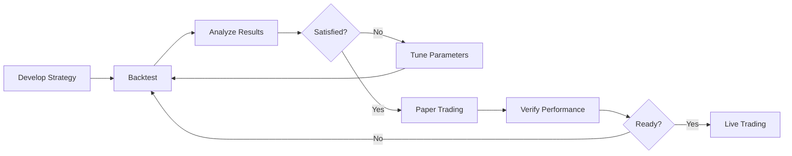

# Strategy Usage Guide: Backtesting vs Live/Paper Trading

This guide explains how to use strategies in both backtesting and live/paper trading modes.

## Overview

The NTP platform uses **NautilusTrader** for both backtesting and live trading. Strategies inherit from `BaseStrategy` and work seamlessly in both modes without code changes.

## Strategy Lifecycle



## Mode Comparison

| Feature | Backtest | Paper Trading | Live Trading |
|---------|----------|---------------|--------------|
| **Data Source** | Historical Parquet files | Live market data (delayed) | Live market data (real-time) |
| **Order Execution** | Simulated | Simulated | Real broker |
| **Risk** | None | None | Real money |
| **Speed** | Fast (historical replay) | Real-time | Real-time |
| **Cost** | Free | Free | Commissions apply |
| **Use Case** | Strategy validation | Final verification | Production |

---

## Part 1: Backtesting

### Step 1: Prepare Historical Data

Follow the [Parquet Data Guide](file:///Users/vortex/Documents/Projects/NTP_tradingPlatform/docs/parquet_data_guide.md) to upload your data.

### Step 2: Configure Your Strategy

Create a strategy configuration matching your existing strategy format:

```json
{
  "id": "backtest-mes-001",
  "name": "MES Backtest Strategy",
  "strategy_type": "SimpleIntervalTrader",
  "instrument_id": "MES.FUT",
  "order_size": 1,
  "enabled": false,
  "parameters": {
    "interval_minutes": 15,
    "hold_minutes": 2
  }
}
```

### Step 3: Run the Backtest

#### Via API:

```bash
curl -X POST http://localhost:8000/backtest/run \
  -H "Content-Type: application/json" \
  -d '{
    "strategy_id": "backtest-mes-001",
    "strategy_config": {
      "id": "backtest-mes-001",
      "name": "MES Backtest Strategy",
      "strategy_type": "SimpleIntervalTrader",
      "instrument_id": "MES.FUT",
      "order_size": 1,
      "parameters": {
        "interval_minutes": 15,
        "hold_minutes": 2
      }
    },
    "instruments": ["MES.FUT"],
    "start_date": "2023-01-01",
    "end_date": "2023-12-31",
    "venue": "SIM",
    "initial_balance": 100000.0,
    "currency": "USD"
  }'
```

Response:
```json
{
  "run_id": "a1b2c3d4-e5f6-7890-abcd-ef1234567890",
  "strategy_id": "backtest-mes-001",
  "statistics": { ... },
  "trades": [ ... ],
  "tearsheet_path": "/path/to/tearsheet.html"
}
```

### Step 4: Analyze Results

#### Download the Tearsheet:

```bash
curl http://localhost:8000/backtest/tearsheet/{run_id} > tearsheet.html
open tearsheet.html
```

The tearsheet includes:
- **Equity Curve**: Visual representation of account balance over time
- **Drawdown Analysis**: Maximum drawdown and recovery periods
- **Monthly Returns Heatmap**: Performance breakdown by month
- **Statistics Table**: Win rate, Sharpe ratio, total PnL, etc.

#### Get Detailed Results:

```bash
curl http://localhost:8000/backtest/results/{run_id}
```

### Step 5: Iterate

Based on backtest results:
1. Adjust strategy parameters
2. Re-run backtest
3. Compare results
4. Repeat until satisfied

---

## Part 2: Paper Trading

Paper trading uses the **same strategy code** but connects to live market data with simulated execution.

### Step 1: Ensure Strategy is Registered

Check that your strategy is in the registry:

```bash
cat backend/app/strategies/registry.json
```

Should include:
```json
[
  {
    "strategy_type": "SimpleIntervalTrader",
    "module": "app.strategies.implementations.simple_interval_trader",
    "class_name": "SimpleIntervalTrader"
  }
]
```

### Step 2: Create Strategy Configuration

Place configuration in `data/strategies/config/`:

```json
{
  "id": "paper-mes-001",
  "name": "MES Paper Strategy",
  "strategy_type": "SimpleIntervalTrader",
  "instrument_id": "MES.FUT-202603-GLOBEX",
  "order_size": 1,
  "enabled": false,
  "parameters": {
    "interval_minutes": 15,
    "hold_minutes": 2
  }
}
```

**Note**: Use the full contract specification for live/paper trading (e.g., `MES.FUT-202603-GLOBEX`)

### Step 3: Start the Strategy

#### Via API:

```bash
# Create the strategy
curl -X POST http://localhost:8000/strategies \
  -H "Content-Type: application/json" \
  -d @data/strategies/config/paper-mes-001.json

# Start the strategy
curl -X POST http://localhost:8000/strategies/paper-mes-001/start
```

#### Via Frontend:

1. Navigate to the Strategies page
2. Find your strategy in the list
3. Click "Start" button

### Step 4: Monitor Performance

#### Real-time Monitoring:

- **Dashboard**: View open positions, PnL, and account metrics
- **Logs**: Check `logs/app.log` for strategy execution details
- **Trades**: View recent trades in the frontend

#### Get Strategy Status:

```bash
curl http://localhost:8000/strategies
```

### Step 5: Stop the Strategy

```bash
curl -X POST http://localhost:8000/strategies/paper-mes-001/stop
```

---

## Part 3: Live Trading

> [!CAUTION]
> Live trading involves real money. Only proceed after thorough backtesting and paper trading validation.

### Prerequisites

1. **Successful Backtests**: Positive results over multiple time periods
2. **Paper Trading Verification**: At least 1-2 weeks of paper trading matching backtest performance
3. **Risk Management**: Clear understanding of maximum drawdown and position sizing
4. **IB Account**: Funded Interactive Brokers account with appropriate permissions

### Step 1: Configure for Live Mode

Update `.env` file:

```bash
TRADING_MODE=live  # Change from 'paper' to 'live'
```

### Step 2: Create Live Strategy Configuration

```json
{
  "id": "live-mes-001",
  "name": "MES Live Strategy",
  "strategy_type": "SimpleIntervalTrader",
  "instrument_id": "MES.FUT-202603-GLOBEX",
  "order_size": 1,
  "enabled": false,
  "parameters": {
    "interval_minutes": 15,
    "hold_minutes": 2
  }
}
```

### Step 3: Start with Small Position Sizes

- Begin with minimum contract sizes
- Monitor for 1-2 days before scaling up
- Verify fills match expected prices

### Step 4: Monitor Closely

- Check positions multiple times per day
- Review trade logs daily
- Monitor for unexpected behavior

### Step 5: Scale Gradually

Only increase position sizes after:
- Consistent performance for 1+ week
- No unexpected issues
- Comfortable with risk exposure

---

## Key Differences Between Modes

### Instrument IDs

| Mode | Format | Example |
|------|--------|---------|
| Backtest | `{SYMBOL}.{TYPE}` | `ES.FUT` |
| Live/Paper | `{SYMBOL}.{TYPE}-{EXPIRY}-{EXCHANGE}` | `MES.FUT-202603-GLOBEX` |

### Data Frequency

- **Backtest**: Processes data as fast as possible (historical replay)
- **Live/Paper**: Real-time, 1-second updates

### State Persistence

- **Backtest**: No persistence (fresh state each run)
- **Live/Paper**: State saved to `data/strategies/state/`

### Error Handling

- **Backtest**: Errors stop the simulation
- **Live/Paper**: Errors logged, strategy may continue or stop based on severity

---

## Best Practices

### Backtesting

1. **Test Multiple Periods**: Don't just test bull markets
2. **Include Commissions**: Use realistic commission models
3. **Account for Slippage**: Assume some slippage on fills
4. **Avoid Overfitting**: Don't optimize too many parameters
5. **Walk-Forward Testing**: Test on out-of-sample data

### Paper Trading

1. **Match Backtest Conditions**: Use same parameters that worked in backtest
2. **Monitor for Discrepancies**: Compare paper results to backtest expectations
3. **Test Edge Cases**: Run during volatile market conditions
4. **Verify Order Handling**: Ensure orders execute as expected

### Live Trading

1. **Start Small**: Use minimum position sizes initially
2. **Set Stop Losses**: Always have risk management in place
3. **Monitor Daily**: Check positions and performance regularly
4. **Keep Records**: Document all trades and decisions
5. **Have an Exit Plan**: Know when to stop a strategy

---

## Troubleshooting

### Backtest Issues

**Problem**: "Instrument not found in catalog"
- **Solution**: Verify data was ingested correctly using `/backtest/available-data`

**Problem**: "No trades executed"
- **Solution**: Check strategy logic, verify data covers the backtest period

### Live/Paper Issues

**Problem**: "Instrument not found"
- **Solution**: Ensure instrument is loaded in `nautilus_manager.py` instrument provider config

**Problem**: "Strategy not starting"
- **Solution**: Check logs for errors, verify IB Gateway connection

---

## Example Workflow

### Complete Backtest-to-Live Workflow

1. **Develop**: Create strategy in `backend/app/strategies/implementations/`
2. **Register**: Add to `registry.json`
3. **Backtest**: Run on 2-3 years of historical data
4. **Optimize**: Tune parameters based on results
5. **Validate**: Run walk-forward test on recent data
6. **Paper Test**: Run in paper mode for 1-2 weeks
7. **Compare**: Verify paper results match backtest expectations
8. **Go Live**: Start with minimum size in live mode
9. **Monitor**: Watch closely for first few days
10. **Scale**: Gradually increase size if performance is good

---

## Additional Resources

- [How to Add a Strategy](file:///Users/vortex/Documents/Projects/NTP_tradingPlatform/docs/how_to_add_strategy.md)
- [Parquet Data Guide](file:///Users/vortex/Documents/Projects/NTP_tradingPlatform/docs/parquet_data_guide.md)
- [NautilusTrader Documentation](https://nautilustrader.io/docs/latest/)
